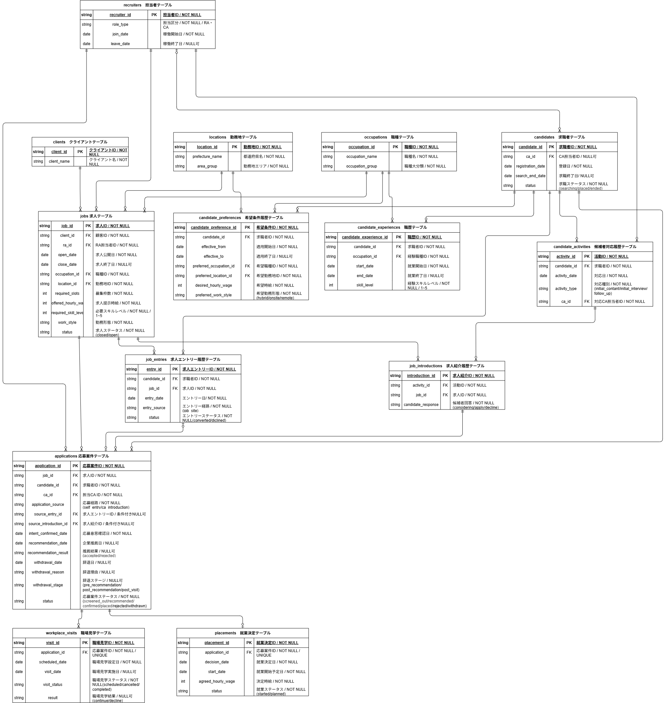

# 人材派遣の求人充足率低下を分析する｜SQL・Python統計分析ポートフォリオ

## 概要

人材派遣事業を想定した合成データを用いて、
求人充足率低下の要因を分析し、改善施策を検討したポートフォリオです。

人材派遣の業務フローをもとに、
求人・求職者・応募・職場見学・就業決定などのデータを設計しました。

SQLで分析マートを作成し、
Pythonによる探索的データ分析（EDA）・仮説検証・ロジスティック回帰を通じて、
求人充足率低下の背景要因を分析しています。

## 分析課題

人材派遣会社の事業責任者から、

> 「前年同期と比較して求人充足率が低下している。
> どこに原因があり、何を改善すべきか分析してほしい」

という依頼を受けた想定で分析を行いました。

2025年と2026年を比較し、求人充足率低下のボトルネックを把握したうえで、背景要因を検証しています。

## 主な分析指標

- 60日以内募集枠充足率
- 応募 → 推薦率
- 推薦 → 職場見学率
- 職場見学 → 就業決定率
- 30日以内就業決定率
- 同職種経験率
- スキルギャップ
- 給与不足率
- 選考途中辞退率
- 応募意思確認 → 推薦までのリードタイム

## 分析の流れ

1. SQLで分析マートを作成
2. PythonでEDAを行い、選考上のボトルネックを特定
3. 仮説を設定し、統計的検定・ロジスティック回帰で検証
4. 分析結果から改善施策を検討

## EDAで確認した主な変化

2025年から2026年にかけて、
60日以内募集枠充足率は26.7%から13.1%へ低下しました。

選考ファネルを確認すると、

- 応募 → 推薦：78.9% → 64.9%（-14.0pt）
- 推薦 → 職場見学：65.9% → 58.4%（-7.5pt）
- 職場見学 → 就業決定：36.2% → 35.1%（-1.1pt）

となっており、
特に応募から推薦・職場見学に至るまでの
選考前半で転換率が悪化していることを確認しました。

あわせて、経験・スキル、給与条件、選考リードタイム、選考途中辞退の傾向を探索し、以下の3つを主な仮説として設定しました。

## 仮説検証

| 仮説 | 検証内容 | 結果 |
| --- | --- | --- |
| 仮説1 | スキル・経験のミスマッチが大きいほど推薦されにくい | 支持 |
| 仮説2 | 給与条件のミスマッチが選考途中辞退が発生しやすい | 支持 |
| 仮説3 | 選考リードタイムが長いほど辞退しやすい | 支持されず |

### 仮説1：スキル・経験ミスマッチ

同職種経験の有無と推薦結果には強い関連が確認されました。

多変量分析でも、同職種経験ありの応募者は経験なしと比較して、
推薦オッズが約13.8倍となりました。

一方、スキルギャップについては統計的な差は確認されたものの、効果量は小さく、
推薦判断には細かなスキル差よりも同職種経験の有無が強く関連していることが分かりました。

### 仮説2：給与条件のミスマッチ

希望給与が求人給与を上回る応募では、選考途中辞退率が高く、給与不足率についても辞退との統計的な関連が確認されました。

多変量分析でも、給与不足率は他の要因を考慮した後も選考途中辞退と有意に関連していました。

一方、補足として確認した推薦結果との関係は限定的でした。

### 仮説3：選考リードタイム

2026年は応募意思確認から推薦までのリードタイムが大きく長期化していました。
一方、2025年・2026年を年別に検証すると、リードタイムと選考途中辞退の明確な関連は確認されませんでした。

多変量分析でも有意な関連は確認されず、
リードタイム長期化そのものが辞退増加の主要因であるとは考えにくい結果となりました。

## 分析結果から考える改善施策

### 1. 重点職種における経験者の母集団形成

同職種経験の有無が推薦結果と強く関連していたことから、
求人需要の大きい職種を重点職種として設定し、該当職種の経験者獲得を強化します。

求人媒体・スカウト・登録導線などで職種別に訴求を分け、
求人需要に対して必要な経験を持つ候補者の母集団形成を強化することを想定しています。

### 2. 給与条件のミスマッチを早期に調整

給与条件のミスマッチは、
推薦よりも選考途中辞退との関連が確認されました。

そのため、推薦前に希望給与と求人給与の乖離を把握し、
乖離が大きい案件については、

- 候補者への条件確認
- 求人条件の再確認
- 派遣先との給与条件交渉

を早期に行うことが有効と考えます。

今後は給与不足率別の辞退率を分析し、条件交渉を優先する基準の設定につなげる余地があります。

### 3. リードタイム短縮は最優先施策としない

2026年はリードタイムが長期化していましたが、辞退との明確な関連は確認されませんでした。

そのため、リードタイム短縮を最優先施策とするよりも、
まずは

- 重点職種の経験者獲得
- 給与条件のミスマッチ解消

を優先する方針が妥当と考えます。

## データについて

本ポートフォリオでは、実在する企業・求職者の情報は使用せず、
人材派遣業務を想定した合成データを使用しています。

実際の業務フローを参考に、データ構造・項目・ステータス遷移・発生ロジックを設計し、
Pythonを用いてデータを生成しました。

主なデータ規模は以下のとおりです。

| データ | 件数 |
| --- | ---: |
| 求職者 | 1,950 |
| 求人 | 800 |
| 応募案件 | 2,658 |
| 職場見学 | 1,211 |
| 就業決定 | 399 |

分析期間は2025年・2026年です。

## データモデル

求人・求職者を中心に、応募、職場見学、就業決定までの人材派遣業務を想定した
データモデルを設計しています。

編集可能なER図：

[recruitment_analytics_erd.drawio](docs/portfolio_260923.drawio)

## 使用技術

| 技術 | 用途 |
| --- | --- |
| SQL / SQLite | 分析マート作成・データ集計 |
| Python | データ生成・分析 |
| pandas / NumPy | データ加工・集計 |
| SciPy | 統計的検定 |
| statsmodels | ロジスティック回帰 |
| matplotlib | 可視化 |
| Jupyter Notebook | EDA・仮説検証 |
| Git / GitHub | バージョン管理 |

## Notebook

- `01_eda.ipynb`
  - データ品質確認
  - 2025年・2026年比較
  - 選考ファネル分析
  - 給与・スキル・リードタイムの探索

- `02_hypothesis_testing.ipynb`
  - 仮説1：スキル・経験ミスマッチ
  - 仮説2：給与条件のミスマッチ
  - 仮説3：選考リードタイム
  - ロジスティック回帰による複数要因分析
  - 改善施策の検討