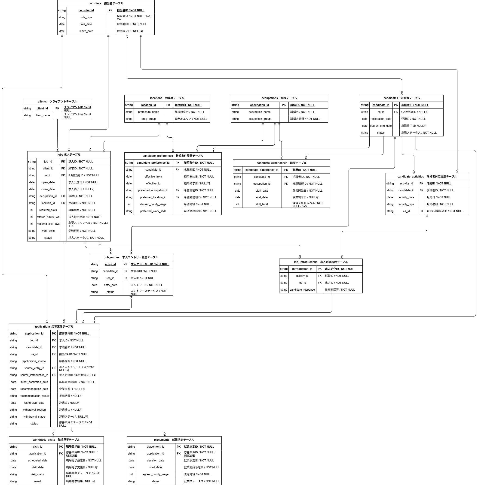

# 人材派遣の求人充足率低下を分析する｜SQL・Python統計分析ポートフォリオ

## 概要

人材派遣事業を想定した合成データを用いて、
求人充足率低下の要因を分析し、改善施策を検討するポートフォリオです。

人材派遣業務の流れをもとに、求人・求職者・応募・職場見学・就業決定などのデータを設計し、
SQLによる分析マートの作成と、Pythonによる探索的データ分析・統計分析を行います。

## 分析テーマ

人材派遣会社の事業責任者から、

> 「前年同期と比較して求人充足率が低下している。
> どこに原因があり、何を改善すべきか分析してほしい」

という依頼を受けた想定で分析を行います。

求人充足率の低下について、以下の観点から要因を確認します。

- 求人需要・候補者供給・担当者キャパシティ
- 給与条件のミスマッチ
- スキルミスマッチ
- 求人ポートフォリオの変化
- 選考プロセスの長期化・途中辞退

また、勤務形態についても探索的に確認します。

## 分析目的

求人充足率が低下している要因を整理し、
営業活動、求人条件、人材供給、マッチング、選考プロセスのどこに改善余地があるのかを明らかにすることを目的とします。

最終的には、分析結果をもとに優先して取り組むべき改善施策を検討します。

## 分析仮説・KPI

求人充足率低下の原因を一つに限定せず、
需給、求人条件、スキル、求人構成、選考プロセス、勤務形態の観点から仮説を設定しています。

| No. | 分析仮説                                                                                         | 主な確認KPI                                                       |
| --- | ------------------------------------------------------------------------------------------------ | ----------------------------------------------------------------- |
| 1   | 求人需要の増加に対して、候補者供給やRA・CAの対応体制が追いついていないのではないか               | 求人数、募集枠数、有効候補者数、1枠あたり候補者数、RA・CA担当件数 |
| 2   | 候補者の希望時給に対して求人の提示時給が低くなり、給与条件のミスマッチが拡大しているのではないか | 希望時給、提示時給、給与不足率                                    |
| 3   | 求人側が求めるスキル水準が上昇し、候補者とのスキルミスマッチが拡大しているのではないか           | 求人要求スキル、候補者スキル、スキルギャップ                      |
| 4   | 充足しにくい職種の求人比率が高まり、求人ポートフォリオが変化しているのではないか                 | 職種別求人構成比、職種別充足率                                    |
| 5   | 応募から推薦・職場見学・就業決定までのプロセスが長期化し、途中辞退が増えているのではないか       | 各工程のリードタイム、辞退率、就業決定率                          |
| 6   | 候補者の希望する勤務形態と求人条件の不一致が、応募や充足に影響しているのではないか               | 勤務形態一致状況、応募状況、充足率                                |

仮説はあらかじめ結論を設定するものではなく、
実際の分析結果から支持されるかどうかを検証します。

## データについて

本ポートフォリオで使用するデータは、
実在する企業・求職者の情報を使用せず、
分析用に作成した合成データです。

これまでの人材派遣業務の知識をもとに、
実際の業務フローを想定してデータ構造、項目、発生ロジックを設計し、
AIとPythonを活用して生成しています。

主なデータ規模は以下のとおりです。

| データ         |  件数 |
| -------------- | ----: |
| 求職者         | 1,950 |
| 求人           |   800 |
| 求人エントリー | 3,219 |
| 求人紹介       | 2,858 |
| 応募案件       | 2,658 |
| 職場見学       | 1,211 |
| 就業決定       |   399 |

分析期間は主に2025年・2026年を対象としています。

## データモデル / ER図

求人・求職者を中心に、
応募、職場見学、就業決定までの人材派遣業務の流れを想定したデータモデルを設計しています。

編集可能なER図はこちらです。

[recruitment_analytics_erd.drawio](docs/portfolio_260923.drawio)

## 使用技術

| 技術             | 用途                               |
| ---------------- | ---------------------------------- |
| Python           | 合成データ生成、データ加工、分析   |
| pandas           | データ加工・集計・探索的データ分析 |
| NumPy            | 数値計算・合成データ生成           |
| SQL              | 分析用データの抽出・集計           |
| SQLite           | 分析用データベース                 |
| Jupyter Notebook | EDA・可視化・統計分析              |
| Git / GitHub     | バージョン管理・成果物公開         |
| draw.io          | ER図作成                           |

## 参考

### ステータス遷移情報

| 業務イベント | 関連テーブル | 状態の変化 |
| --- | --- | --- |
| 求職者が登録し、求職活動を開始する | `candidates` | `status = searching` |
| 求職者が求職活動を終了する | `candidates` | `status = ended`、`search_end_date` を設定 |
| 求職者が求人サイト上で求人へエントリーする | `job_entries` | エントリーレコードを作成 |
| 求人エントリーが正式な応募案件につながる | `job_entries` / `applications` | `job_entries.status = converted`、`applications` レコードを作成 |
| 求人エントリーが正式な応募案件につながらない | `job_entries` | `status = declined` |
| CAが候補者へ求人を紹介する | `candidate_activities` / `job_introductions` | 求人紹介レコードを作成 |
| CAからの求人紹介に対して候補者が応募を希望する | `job_introductions` / `applications` | `candidate_response = apply`、応募条件を満たした場合に `applications` レコードを作成 |
| CAからの求人紹介を候補者が検討する | `job_introductions` | `candidate_response = considering` |
| CAからの求人紹介を候補者が辞退する | `job_introductions` | `candidate_response = decline` |
| 候補者の応募意思を確認する | `applications` | `intent_confirmed_date` を設定し、応募案件として管理開始 |
| 応募意思確認済み・次工程判定待ち／処理中 | `applications` | `status = confirmed` |
| CAが候補者と求人の適合性を確認し、企業推薦を見送る | `applications` | `status = screened_out` |
| 企業推薦前に候補者が辞退する | `applications` | `status = withdrawn`、`withdrawal_stage = pre_recommendation` |
| CAが候補者を企業へ推薦する | `applications` | `recommendation_date` を設定 |
| 企業推薦が通過する | `applications` | `recommendation_result = accepted`、`status = recommended` |
| 企業推薦段階で不成立となる | `applications` | `recommendation_result = rejected`、`status = rejected` |
| 企業推薦後、職場見学前に候補者が辞退する | `applications` | `status = withdrawn`、`withdrawal_stage = post_recommendation` |
| 職場見学の日程を設定する | `workplace_visits` | `scheduled_date` を設定 |
| 職場見学日程を設定後、実施前に候補者が辞退する | `workplace_visits` / `applications` | `visit_status = cancelled`、`applications.status = withdrawn`、`withdrawal_stage = post_recommendation` |
| 職場見学日程は設定済みだが、観察期間内に実施されていない | `workplace_visits` | `visit_status = scheduled` |
| 職場見学を実施する | `workplace_visits` | `visit_status = completed`、`visit_date` を設定 |
| 職場見学後も選考を継続する | `workplace_visits` | `result = continue` |
| 職場見学後に次工程へ進まない | `workplace_visits` / `applications` | `result = decline`、`applications.status = rejected` |
| 職場見学後、就業決定前に候補者が辞退する | `applications` | `status = withdrawn`、`withdrawal_stage = post_visit` |
| 候補者が別求人で就業決定し、並行していた他の選考を終了する | `applications` | `status = withdrawn`、`withdrawal_reason = accepted_other_job` |
| 推薦後・職場見学後などの選考過程で、候補者辞退以外の理由により不成立となる | `applications` | `status = rejected` |
| 候補者と求人企業の双方が条件に合意し、就業が決定する | `applications` / `placements` / `candidates` | `applications.status = placed`、`placements` レコードを作成、`candidates.status = placed` |
| 就業決定後、分析期間内に就業開始日を迎える | `placements` | `status = started` |
| 就業決定済みだが、就業開始日が分析期間後である | `placements` | `status = planned` |

※ `applications.status = rejected` は、候補者辞退以外の理由で選考が終了した案件を表す。企業推薦段階の不成立は `recommendation_result = rejected`、職場見学後の不成立は `workplace_visits.result = decline` から判別できる。その他の不成立理由は、現在のデータ項目だけでは詳細に区別できない。